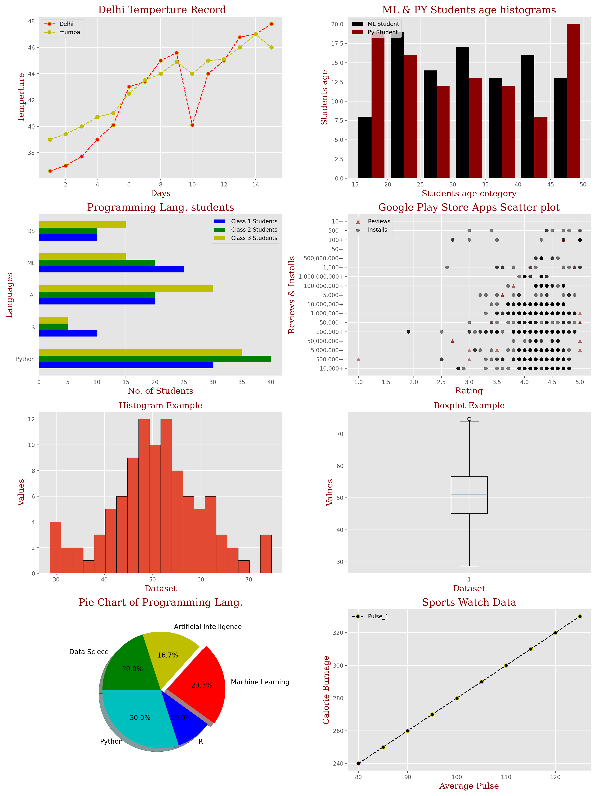

# Data Visualization Practice ( Matplotlib )

This repository contains a complete collection of Matplotlib practice files focused on understanding and implementing essential plotting and data visualization concepts using Python.

---

##  Concepts Covered

- Basic Visualization with Title, labels, legend, and plot customization (color, marker, linestyle)   
- Line Plot  
- Double Line Plot
- Histogram
- Bar chart
- Scatter plot
- Pie chart
- Box Plot
- Subplot
  
 
 ---

## Visualization

## Tech Stack
 
- Matplotlib
- Python
- NumPy

---

