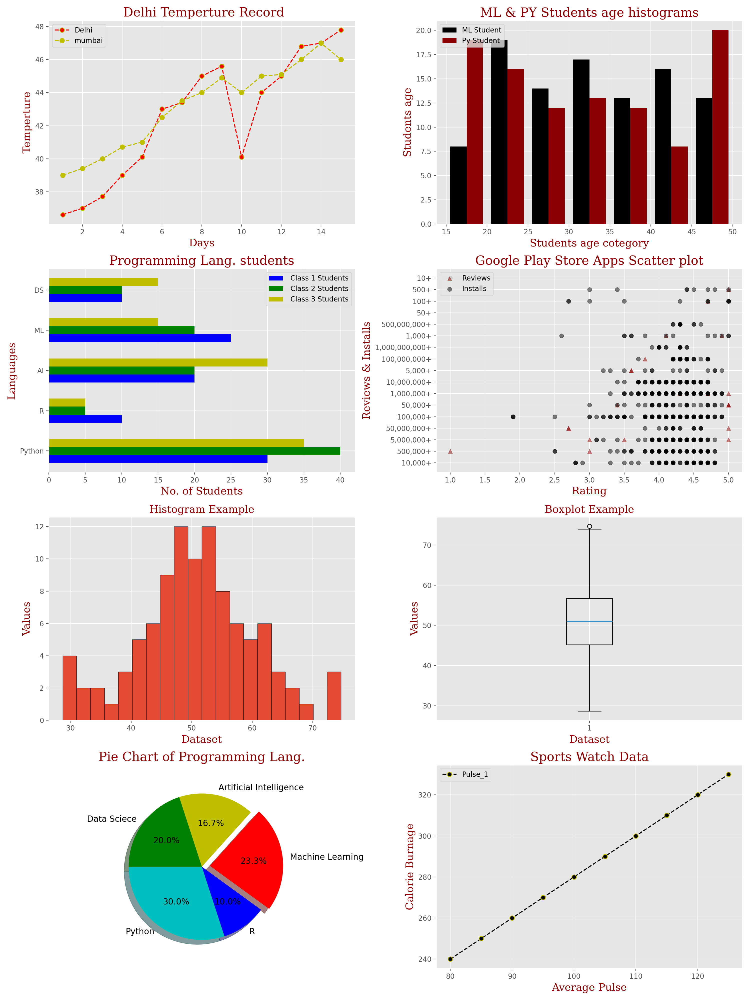

# Data Visualization with Matplotlib


A structured collection of Matplotlib practice notebooks covering the core plotting techniques used in data analysis and scientific visualization. Each concept is implemented in Python with annotated examples and output figures.

---

## Overview

This repository is designed to build a practical foundation in data visualization using Matplotlib. It progresses from basic single-plot construction to multi-panel layouts, covering the chart types most frequently used in exploratory data analysis and reporting.

---

## Concepts Covered

| Topic | Description |
|---|---|
| Plot Customization | Titles, axis labels, legends, colors, markers, and line styles |
| Line Plot | Single-variable trends over a continuous axis |
| Double Line Plot | Comparative multi-series visualization on a shared axis |
| Histogram | Distribution of numerical data across bins |
| Bar Chart | Categorical comparison using vertical bars |
| Scatter Plot | Relationship and correlation between two variables |
| Pie Chart | Proportional breakdown of categorical data |
| Box Plot | Distribution summary with quartiles and outliers |
| Subplot | Multi-panel figures using `plt.subplot()` and `plt.subplots()` |

---

## Sample Output



---

## Tech Stack

 - Python
 - Numpy
 - Matplotlib
 - Jupyter Notebook

---

## Getting Started

```bash
# Clone the repository
git clone https://github.com/pranay-surya/Matplotlib.git
cd Matplotlib

# Install dependencies
pip install matplotlib numpy

# Launch Jupyter Notebook
jupyter notebook
```

---

## Repository Structure

```
Matplotlib/
|-- notebook1          # Practice notebooks for each plot type
|-- notebook2
|--
|--
|-- Figure_2_mat.png    # Sample visualization output
|-- README.md
```

---

 
